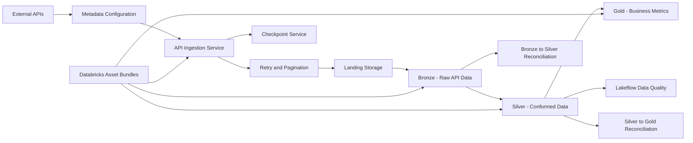

# Enterprise API Ingestion Platform

A metadata-driven API ingestion and data engineering platform built with
**Python, Azure Databricks, Lakeflow Declarative Pipelines, Unity
Catalog, Delta Lake, and Databricks Asset Bundles (DAB)**.

The platform is designed to ingest APIs through configuration rather
than source-code changes, land raw responses, transform data through a
Medallion architecture, apply data-quality rules, maintain ingestion
checkpoints, and validate data consistency across processing layers.

---

## Architecture



### Medallion flow

```text
External API
    |
    v
Metadata-driven ingestion
    |
    +-- Authentication
    +-- Retry handling
    +-- Pagination
    +-- Checkpoint handling
    |
    v
Landing
    |
    v
Bronze
    |
    v
Silver
    |
    +-- Deduplication
    +-- Flattening
    +-- Surrogate keys
    +-- Dimension enrichment
    +-- Data quality expectations
    |
    v
Gold
    |
    +-- Order KPIs
    +-- Customer sales
    +-- Product sales
```

---

## Key capabilities

### Metadata-driven ingestion

API behavior is controlled through metadata rather than hard-coded
API-specific ingestion logic.

Metadata controls concepts such as:

* API endpoint
* HTTP method
* authentication type
* authentication configuration
* headers
* query parameters
* pagination strategy
* page size
* cursor field
* cursor parameter
* load type
* incremental configuration
* landing configuration
* Bronze configuration
* record path
* enabled/disabled state

This allows additional APIs to be onboarded through configuration while
reusing the same ingestion framework.

### Authentication

The ingestion framework supports configurable authentication metadata.

Authentication configuration is separated from ingestion logic so that
the ingestion service does not need API-specific authentication code.

Secrets and credentials should be stored in secure secret-management
systems and must never be committed to source control.

### Pagination

The platform implements a pagination strategy pattern.

Supported strategies include:

* `NONE`
* `OFFSET`
* `CURSOR`

The pagination factory selects the appropriate implementation from API
metadata.

Cursor pagination supports:

* configurable cursor field
* configurable cursor parameter
* initial query parameters
* next-page cursor handling
* persisted cursor state

Pagination behavior is covered by automated tests.

### Retry handling

The HTTP layer implements retry behavior for transient failures.

Retryable conditions include common transient HTTP status codes such as:

* `408`
* `429`
* `500`
* `502`
* `503`
* `504`

Connection and timeout failures are also handled through retry logic.

Non-retryable HTTP failures fail immediately.

The retry policy is configurable and covered by automated tests.

---

## Data architecture

### Landing

The Landing layer stores raw API responses before structured processing.

The ingestion service writes API payloads to the configured landing
location.

The design preserves the raw response so that downstream processing can
be separated from API extraction.

### Bronze

Bronze is implemented using Lakeflow Declarative Pipelines and JSON Auto
Loader.

The Bronze pipeline:

* reads API landing files
* uses Auto Loader
* supports schema evolution
* preserves source-file metadata
* preserves API identifiers
* records ingestion timestamps
* flattens configured record paths
* writes structured Bronze tables

Example Bronze table:

```text
<catalog>.bronze.openapi_orders
```

The Bronze layer is intentionally close to the source representation.

### Silver

Silver converts Bronze data into business-ready, conformed datasets.

The current implementation includes examples such as:

* `fact_order`
* `dim_customer`
* `dim_product`

The Silver transformation layer performs operations including:

* latest-record selection
* deduplication
* nested-data flattening
* array explosion
* dimension enrichment
* deterministic surrogate-key generation
* type conversion
* business-key handling

### Order example

An API order can contain multiple products.

The Silver `fact_order` model converts this structure into order-line
grain:

| Column | Description |
|---|---|
| `order_id` | Source order identifier |
| `line_number` | Deterministic order-line position |
| `customer_id` | Source customer identifier |
| `product_id` | Source product identifier |
| `quantity` | Ordered quantity |
| `order_date` | Order timestamp |
| `status` | Order status |
| `order_total` | Order-level monetary total |
| `customer_sk` | Customer surrogate key |
| `product_sk` | Product surrogate key |

The business key is:

```text
(order_id, line_number)
```

### Gold

Gold provides business-oriented aggregated datasets.

Current Gold datasets include:

#### `gold_order_kpis`

One row per order.

Metrics include:

* customer
* order date
* status
* order total
* line count
* units sold

#### `gold_customer_sales`

One row per customer.

Metrics include:

* order count
* sales amount
* units sold
* customer attributes

#### `gold_product_sales`

One row per product.

Metrics include:

* order count
* units sold
* first order date
* last order date
* product attributes

Product-level revenue is intentionally not calculated because the source
API provides order-level totals rather than product-level monetary
amounts.

---

## Data Quality

The Silver `fact_order` dataset currently has five Lakeflow
expectations:

* `valid_order_id`
* `valid_line_number`
* `valid_customer_id`
* `valid_product_id`
* `valid_quantity`

The quantity expectation requires:

```sql
quantity IS NOT NULL
AND quantity > 0
```

The expectations use failure semantics so invalid records do not
silently enter the trusted Silver dataset.

The current deployed pipeline execution verified:

| Expectation | Failed records |
|---|---:|
| `valid_order_id` | 0 |
| `valid_line_number` | 0 |
| `valid_customer_id` | 0 |
| `valid_product_id` | 0 |
| `valid_quantity` | 0 |

Additional data-quality coverage can be added to other datasets as the
platform expands.

---

## Reconciliation

The platform includes automated integration tests that validate data
consistency across Medallion layers.

### Bronze to Silver

The reconciliation verifies:

* latest Bronze order population
* Silver distinct order population
* Silver order-line business-key uniqueness

Current validated result:

| Metric | Result |
|---|---:|
| Latest Bronze orders | 150 |
| Silver distinct orders | 150 |

Silver order-line validation:

| Metric | Result |
|---|---:|
| Silver rows | 433 |
| Distinct `(order_id, line_number)` | 433 |
| Duplicate business keys | 0 |

Therefore:

```text
Bronze orders = Silver orders

150 = 150
```

### Silver to Gold

The reconciliation verifies:

* Silver distinct orders vs Gold order KPI rows
* Silver units vs Gold units
* Silver order-level sales vs Gold sales
* Gold order-key uniqueness

Current validated result:

| Metric | Silver | Gold |
|---|---:|---:|
| Orders | 150 | 150 |
| Units sold | 879 | 879 |
| Sales | 201,161 | 201,161 |

Gold duplicate orders:

```text
0
```

The reconciliation intentionally does not compare:

```sql
SUM(fact_order.order_total)
```

directly with Gold sales.

Because `order_total` is an order-level value repeated on every Silver
order line, summing it at line grain would multiply the total.

Example:

| Calculation | Amount |
|---|---:|
| Silver line-level `SUM(order_total)` | 703,152 |
| Correct order-level sales | 201,161 |
| Gold sales | 201,161 |

The reconciliation therefore first reduces Silver to one `order_total`
per `order_id`.

This protects against a common order-line aggregation error.

---

## Checkpoint framework

The platform includes a checkpoint model, repository, and service.

The checkpoint model supports:

* `CURSOR`
* `WATERMARK`

The checkpoint table is designed to persist ingestion state for API
sources.

The checkpoint service supports:

* retrieving the latest checkpoint
* cursor state
* watermark state
* initial-load values
* watermark overlap handling
* API-specific checkpoint lookup
* Delta-backed persistence

For `FULL` loads, checkpoint persistence is intentionally not required.

### Current status

The checkpoint framework and cursor checkpoint implementation are
complete and unit-tested.

The currently enabled API metadata uses `FULL` loads. Live incremental
API end-to-end validation is therefore listed as a planned enhancement.

---

## Current metadata examples

The current project contains metadata-driven API configurations for
examples including:

* OpenAPI Orders
* OpenAPI Products
* OpenAPI Users
* Salesforce Opportunity

The metadata model separates source configuration from transformation
logic.

This means ingestion behavior can be changed through metadata instead of
creating separate ingestion implementations for every API.

---

## Repository structure

```text
enterprise_api_ingestion_platform/
|
+-- databricks.yml
+-- pyproject.toml
+-- README.md
|
+-- resources/
|   +-- jobs/
|   |   +-- ...
|   +-- pipelines/
|       +-- bronze.pipeline.yml
|       +-- silver.pipeline.yml
|       +-- gold.pipeline.yml
|
+-- src/
|   +-- enterprise_api_ingestion_platform/
|       |
|       +-- checkpoint/
|       |   +-- checkpoint_model.py
|       |   +-- checkpoint_repository.py
|       |   +-- checkpoint_service.py
|       |
|       +-- gold/
|       |   +-- gold_pipeline.py
|       |   +-- transformations.py
|       |
|       +-- landing/
|       |   +-- landing_service.py
|       |   +-- ...
|       |
|       +-- metadata/
|       |   +-- metadata_reader.py
|       |   +-- ...
|       |
|       +-- pagination/
|       |   +-- cursor_pagination.py
|       |   +-- offset_pagination.py
|       |   +-- none_pagination.py
|       |   +-- pagination_factory.py
|       |   +-- pagination_strategy.py
|       |
|       +-- retry/
|       |   +-- http_client.py
|       |   +-- retry_policy.py
|       |
|       +-- silver/
|       |   +-- silver_pipeline.py
|       |   +-- transformations.py
|       |
|       +-- bronze_pipeline/
|       |   +-- bronze_pipeline.py
|       |
|       +-- ingestion/
|       |   +-- ingestion_service.py
|       |   +-- ...
|       |
|       +-- main.py
|
+-- tests/
|   +-- checkpoint/
|   +-- gold/
|   |   +-- test_gold_customer_sales.py
|   |   +-- test_gold_order_kpis.py
|   |   +-- test_gold_product_sales.py
|   |   +-- test_reconciliation.py
|   |
|   +-- ingestion/
|   +-- landing/
|   +-- metadata/
|   +-- pagination/
|   +-- retry/
|   +-- silver/
|       +-- test_dim_customer.py
|       +-- test_dim_product.py
|       +-- test_fact_order.py
|       +-- test_reconciliation.py
|
+-- fixtures/
    +-- ...
```

---

## Technology stack

| Technology | Purpose |
|---|---|
| Python | Application and transformation logic |
| PySpark | Distributed data processing |
| Azure Databricks | Data engineering platform |
| Lakeflow Declarative Pipelines | Bronze/Silver/Gold processing |
| Delta Lake | Transactional data storage |
| Unity Catalog | Data governance and object management |
| Auto Loader | Incremental file ingestion |
| Databricks Asset Bundles | Infrastructure and deployment |
| Databricks Connect | Local integration testing |
| pytest | Automated testing |
| Ruff | Python linting |
| uv | Python dependency/environment management |
| Git/GitHub | Version control and collaboration |

---

## Local development

### Prerequisites

Install:

* Python 3.10-3.12
* `uv`
* Databricks CLI
* Git
* Access to an appropriate Databricks workspace for integration tests

### Install dependencies

```powershell
uv sync --dev
```

### Run unit and integration tests

The complete test suite can be run with:

```powershell
uv run pytest -v
```

Databricks integration tests use:

```powershell
$env:RUN_DATABRICKS_TESTS="1"
```

For example:

```powershell
$env:RUN_DATABRICKS_TESTS="1"
uv run pytest tests/silver/test_reconciliation.py -v
```

### Run Ruff

```powershell
uv run ruff check .
```

---

## Databricks Asset Bundles

The project is deployed using Databricks Asset Bundles.

### Validate

```powershell
databricks bundle validate -t dev
```

### Deploy

```powershell
databricks bundle deploy -t dev
```

### View deployment summary

```powershell
databricks bundle summary -t dev
```

The bundle manages:

* API ingestion job
* Bronze pipeline
* Silver pipeline
* Gold pipeline
* Landing volume
* Python package artifacts
* pipeline configuration

---

## Pipeline execution

The deployed workflow follows:

```text
ingest_api
    |
    v
bronze_pipeline
    |
    v
silver_pipeline
    |
    v
gold_pipeline
```

Each downstream stage depends on successful completion of the previous
stage.

The development schedule is intentionally kept paused while development
and validation are performed manually.

---

## Testing status

The project has been validated through unit, application-layer, and
Databricks integration testing.

### Current verified local validation

```text
uv run ruff check .
All checks passed

uv run pytest -q --ignore=tests/silver --ignore=tests/gold
89 passed

uv run pytest -q tests/landing tests/ingestion
6 passed
```

The Silver and Gold integration tests require live Databricks compute for
`DatabricksSession` initialization. When that runtime is not available
locally, those tests cannot execute as ordinary local unit tests.

### Test coverage includes

* checkpoint model
* checkpoint repository
* checkpoint service
* ingestion service
* landing service
* metadata reader
* cursor pagination
* pagination factory
* retry policy
* HTTP retry behavior
* Silver transformations
* Gold transformations
* Bronze to Silver reconciliation
* Silver to Gold reconciliation
* Lakeflow data-quality expectations

## Engineering principles

The project follows several engineering principles.

### Metadata over hard-coded API logic

API-specific behavior belongs in metadata whenever practical.

### Separation of concerns

Responsibilities are separated across:

* Metadata
* Ingestion
* HTTP
* Retry
* Pagination
* Landing
* Checkpoint
* Bronze
* Silver
* Gold
* Data Quality
* Testing
* Deployment

### Deterministic transformations

Surrogate keys and business keys are designed to provide deterministic
behavior where required.

### Explicit data contracts

Transformation logic operates against defined schemas and expected
business grains.

### Fail-fast data quality

Critical Silver validation rules use failure semantics rather than
allowing invalid records to silently propagate.

### Reconciliation at business grain

Reconciliation is performed at the correct semantic grain rather than
relying on naive row-count or line-level monetary comparisons.

---

## Security

This repository is intended to be public.

Do not commit:

* access tokens
* passwords
* client secrets
* API keys
* Databricks personal access tokens
* OAuth tokens
* connection strings containing credentials
* production secret values
* private workspace configuration

Use environment variables, Databricks secret scopes, managed identities,
service principals, or other appropriate secret-management mechanisms.

If a credential is accidentally exposed, revoke or rotate it
immediately.

---

## Production-readiness status

### Completed

* Metadata-driven ingestion framework
* Configurable API metadata model
* API authentication abstraction
* HTTP client abstraction
* Transient HTTP retry handling
* Configurable retry policy
* NONE pagination
* OFFSET pagination
* CURSOR pagination
* Pagination strategy factory
* Raw API landing layer
* Storage writer abstraction
* Databricks-managed Unity Catalog Volume landing
* Bronze Lakeflow Declarative Pipeline
* Auto Loader ingestion
* Bronze source metadata preservation
* Bronze API identifier preservation
* Bronze ingestion timestamps
* Configurable Bronze record-path handling
* Silver Lakeflow Declarative Pipeline
* Order-line fact modeling
* Customer dimension modeling
* Product dimension modeling
* Nested JSON flattening
* Array explosion
* Deduplication
* Deterministic surrogate-key generation
* Business-key handling
* Dimension enrichment
* Type conversion
* Gold order KPI model
* Gold customer sales model
* Gold product sales model
* Lakeflow data-quality expectations
* Fail-fast critical Silver validation
* Cursor checkpoint implementation
* Watermark checkpoint model and framework
* Initial-load checkpoint handling
* Watermark overlap handling
* API-specific checkpoint lookup
* Delta-backed checkpoint persistence
* Bronze-to-Silver reconciliation
* Silver-to-Gold reconciliation
* Automated test coverage
* Ruff code-quality validation
* Databricks Asset Bundle validation
* Databricks Asset Bundle deployment
* Databricks job orchestration
* Ingestion → Bronze → Silver → Gold dependency chain
* Unity Catalog table architecture
* Application-level execution audit logging
* Execution run identifiers
* Execution duration tracking
* Records-read metrics
* Pages-read metrics
* Landing-file tracking
* Landing-file-size tracking
* Execution status tracking
* Schema-version metadata tracking
* Git version control
* GitHub repository integration
* Public-portfolio documentation

### Planned enhancements

* Rich custom success/failure notifications
* Failure diagnostics and retry metrics propagation
* Operational SLA/status monitoring
* Formal end-to-end reconciliation reporting
* Automatic schema-change detection and schema-version management
* Live incremental API end-to-end validation
* Production deployment hardening
* CI/CD automation with GitHub Actions
* Extended documentation and operational runbooks

## Example end-to-end result

A representative successful pipeline execution currently produces:

```text
Bronze
  Latest orders:                150

Silver
  Distinct orders:              150
  Order lines:                  433
  Units sold:                   879
  Duplicate order lines:          0

Gold
  Order KPI rows:               150
  Distinct orders:              150
  Units sold:                   879
  Sales:                    201,161
  Duplicate order keys:           0
```

The key reconciliation is:

```text
Bronze orders = Silver orders = Gold orders

150 = 150 = 150
```

And the business metrics reconcile:

```text
Silver units = Gold units

879 = 879
```

```text
Silver order-level sales = Gold sales

201,161 = 201,161
```

This demonstrates that the current implementation preserves order
populations and key business metrics across the Bronze, Silver, and Gold
layers.

---

## Why this project matters

The goal is not simply to build another API-to-table pipeline.

The platform demonstrates how to build a reusable data ingestion
framework where:

```text
New API
   |
   v
Metadata configuration
   |
   v
Reusable ingestion framework
   |
   v
Standardized Landing
   |
   v
Bronze
   |
   v
Reusable Silver transformations
   |
   v
Business-focused Gold datasets
   |
   v
Data Quality
   |
   v
Automated Reconciliation
```

The architecture reduces API-specific code, centralizes ingestion
behavior, improves consistency across sources, and provides automated
validation of downstream business data.

---

## License

This project is currently maintained as a portfolio and engineering
demonstration project.

Add an explicit open-source license before accepting external
contributions or redistributing the project.

---

## Author

**Karan Singh Navalur**

Data Engineering project focused on:

* Azure Databricks
* Python
* PySpark
* Lakeflow Declarative Pipelines
* Delta Lake
* Unity Catalog
* Metadata-driven architecture
* API ingestion
* Data Quality
* Data Reconciliation
* Databricks Asset Bundles
* Git/GitHub workflows
